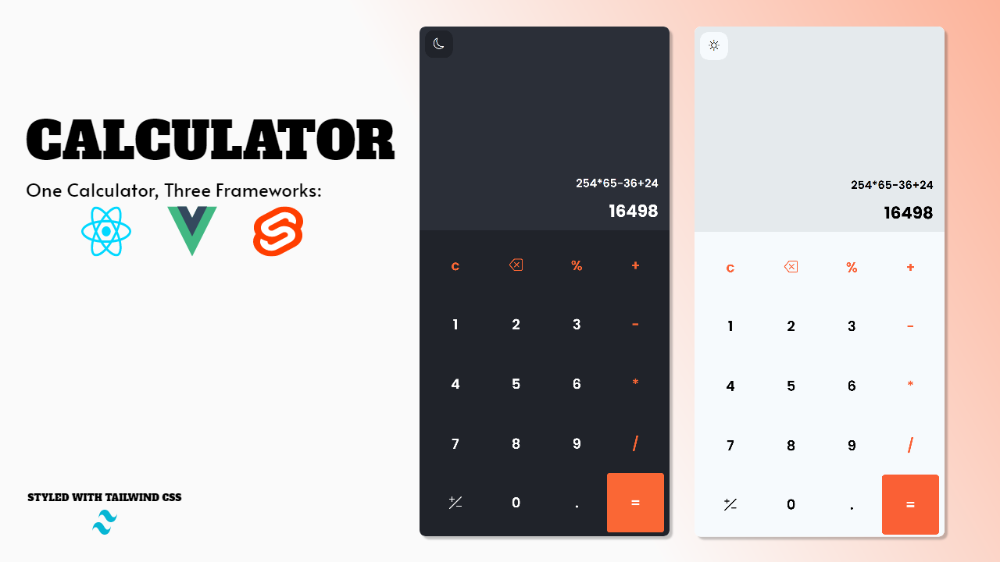

# Calculator Comparison: Vue.js, Svelte, and React

## Introduction
I started this project to compare the process of building a calculator using three popular JavaScript frameworks: **Vue.js, Svelte, and React**. My goal was to analyze the differences in syntax, reactivity, state management, and overall development experience.

## Why This Comparison?
Each framework has its own strengths and weaknesses. By implementing the same project across these three frameworks, I aimed to gain insights into:
- Ease of setup and development workflow
- State management differences
- Code readability and maintainability
- Performance and responsiveness

## Framework Breakdown
### 1. **Vue.js**
Vue provides a simple and intuitive way to build UIs. Some notable aspects of using Vue for this calculator:
- **Reactive state management** via the `ref()` and `reactive()` APIs.
- **Declarative rendering** using template syntax.
- **Two-way data binding** with `v-model` for input handling.
- **Component-based architecture** with single-file components.

### 2. **Svelte**
Svelte takes a unique approach by compiling components into highly efficient vanilla JavaScript.
- **No virtual DOM** – Directly updates the DOM for better performance.
- **Simpler reactivity** using assignment (`let count = 0; count += 1;` automatically updates the UI).
- **Minimal boilerplate**, making it easy to write and read.
- **Built-in animations and transitions** without needing extra libraries.

### 3. **React**
React is the most widely used framework, relying on a virtual DOM for efficient updates.
- **Component-based UI development** using JSX.
- **State management** using `useState()` and hooks.
- **Declarative approach** for rendering UI updates.
- **Strong ecosystem** with libraries like Redux, React Query, and more.

## Key Comparisons
| Feature          | Vue.js            | Svelte            | React            |
|-----------------|------------------|------------------|------------------|
| State Management | `reactive()` & `ref()` | Auto-reactive variables | `useState()` & hooks |
| Performance     | Good (Virtual DOM) | Excellent (Direct DOM updates) | Good (Virtual DOM) |
| Syntax         | HTML, JS, and CSS in `.vue` files | Simple, no extra boilerplate | JSX-based, requires Babel |
| Learning Curve | Easy to moderate | Easiest to pick up | Moderate to difficult |
| Community & Ecosystem | Large & growing | Smaller but growing | Largest with many third-party libraries |

## Conclusion
Each framework has its own advantages:
- **Vue.js** is great for beginners and offers a balance between ease of use and performance.
- **Svelte** is the most lightweight and efficient, making it ideal for small projects and quick development.
- **React** is powerful for large-scale applications with a vast ecosystem of libraries.

If you're looking for an easy entry into modern front-end development, **Svelte** might be the best choice. If you want a well-balanced framework, **Vue.js** is great. And if you need a robust, scalable solution with extensive community support, **React** is the way to go.

## How to Run the Project
To run the calculators in each framework:
```bash
# Clone the repository
git clone https://github.com/WebDiciples/vue-svelte-react-calculator-project.git
cd vue-svelte-react-calculator-project

# Navigate to the respective framework folder and install dependencies
cd folder
npm install
npm run dev

```

## License
This project is open-source under the MIT License.

## Acknowledgments
- Vue.js: [https://vuejs.org](https://vuejs.org)
- Svelte: [https://svelte.dev](https://svelte.dev)
- React: [https://react.dev](https://react.dev)



Feel free to contribute or share your thoughts!

